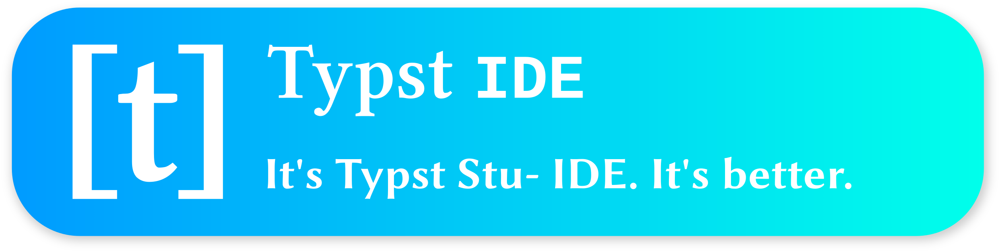
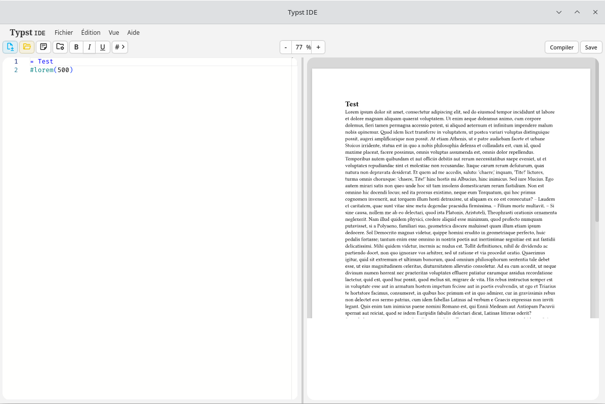

# Typst IDE

[Typst Studio](https://gitlab.com/gnoooo/typst_studio), rebuilt with Tauri and Rust.
Harder. Better. Faster. Stronger.



A modern local Typst editor (not a lie anymore, since Electron has been replaced with Tauri), with an intuitive writing experience.

# Preview


# Installation
## Users
Check out the [releases](https://github.com/gnoooo/typst-ide/releases) page for the latest version.

Currently, there are 4 versions available:
- **Debian/Ubuntu**: `.deb` file
- **Fedora/Red Hat**: `.rpm` file
- **ArchLinux**: PKGBUILD (clone the repo + `makepkg -si`)
- **Other**: AppImage **DOES NOT WORK, PROBLEM WITH WEBKIT BUNDLED** 

## Developers
### Prerequisites
- Rust + Cargo
- Node.js + npm
- Tauri CLI : ```bash cargo install tauri-cli```

### Setup
Clone this repository:
```sh
git clone https://gitlab.com/gnoooo/typst-ide
cd typst-ide
```

Nothing else to initialize, the whole repository is pushed. However, a few steps are required to set up the workspace:
1. NPM
    ```bash
    cd frontend
    npm install
    ```
2. Cargo
    ```bash
    # if you are in frontend/
    cd ../crates/app
    cargo tauri build # then pray
    ```

### Build the app

To build the app (into `.deb`/`.rpm`/AppImage packages for Linux and a setup executable for Windows), we have to:
1. Build the frontend:
    ```bash
    cd frontend/
    npm run build   # => vite build (Tailwind CSS is compiled via PostCSS)
    ```
2. Build the app (it's long...):
    - Windows
        ```bash
        cd crates/app/
        cargo tauri build --target x86_64-pc-windows-gnu
        ```
    - Linux
        ```bash
        cd crates/app/
        NO_STRIP=1 cargo tauri build --target x86_64-unknown-linux-gnu
        ```
        - `NO_STRIP=1` helps avoid the `failed to bundle project \`failed to run linuxdeploy\`` error
3. The executable files will be in:
    - Linux : `$HOME/path/to/typst-ide/target/x86_64_unknown-linux-gnu/release/bundle/deb/Typst IDE_x.y.z_amd64.deb` (and `rpm/`, `appimage/` next to it)
    - Windows : `$HOME/path/to/typst-ide/target/x86_64-pc-windows-gnu/bundle/nsis/Typst IDE_x.y.z_x64-setup.exe`

# Usage
## Typical workflow
When you first open the app, you'll see two windows:


On the left, you'll find the editor, where you can write your Typst documents.
On the right, you'll find the preview, where you can see how your document looks like. You can now start typing your document, and the preview will update automatically as you type.


But as you can see, on the top left, there are two buttons blinking:
- The blue one on the left, will prompt you to create a new project, by entering a name and a path. No worries, what you have typed so far will be saved in the created project.
- The orange one on the right, will prompt you to open an existing project. 

When a project is opened, or saved, the buttons will stop blinking (and the project creation button will be hidden), it's just a reminder so you open or create your project, so the auto-save feature works correctly.

### Toolbar overview

The toolbar provides several tools (from left to right):

| Button | Action |
|--------|--------|
| Disk (blinking blue) | Create a new project |
| Opened folder (blinking orange) | Open a project in history |
| Notepad and pencil | Open the note-bloc |
| Folder with cog | Manage files of project |
| **B I U** | Formatting (bold, italic, underline) |
| **#** | Insert a struture (table, grid, rect, figure) |
| **− 100% +** | Preview zoom |
| **Compile** | Force recompile |
| **Save** | Export in PDF |


### Project file manager

Accessible from the `folder_managed` button in the toolbar or via **`Edit, Manage project files`**.

Displays the complete directory tree of the current project, with:
- **Collapsible folders**: click the `>` chevron to expand or collapse folders
- **Search bar**: filters files by name while preserving parent folders
- **Drag & drop**: drag and drop a file or folder into another folder to move it (confirmation required)
- **Import file**: opens the native file picker and copies the selected files into the project
- **New folder**: creates a folder at the project root
- **Delete**: removes a file or folder (confirmation required)

Context actions (shown when hovering over a file):
- **Images** (`.png`, `.jpg`, `.gif`, `.svg`, `.webp`): 
    - **Insert** button (inserts `#image("path")` into the editor), 
    - **Hover preview** (image tooltip displayed if static)
- **Bibliographies** (`.bib`): 
    - **Bibliography** button (opens the bibliography manager for that file)

## Notepad

Accessible from the `sticky_note_2` toolbar button or via **`Edit, Open notepad`**.

The Notepad lets you write reusable text snippets for your Typst documents.

Notes can have two scopes:
- **Global**: available across all projects
- **Project**: available only in the current project

Each note provides the following actions: insert into the editor, edit, preview, and delete. 

A **search bar** lets you filter notes by title or content.

## Bibliography

Accessible via **`Edit, Manage bibliographies`**.

Lists all `.bib` files in the current project, with the following actions:
- **Add bibliography**: creates a new `.bib` file
- **Edit**: modify the title, style, or path
- **Code**: edit the raw contents of the `.bib` file
- **Delete**: remove the bibliography (confirmation required)

Clicking on a bibliography opens its **references** (individual entries), where you can:
- Add, edit, or delete references
- Modify each reference's fields
- Use the **search bar** to filter references by key or value

## Project history

Accessible from the `folder_open` toolbar button.

Lists previously opened projects, with the following actions:
- Click a project to open it in the editor
- **Eye**: preview the `.typ` file
- **Edit**: change the project's path
- **Delete**: remove it from the history

A **search bar** lets you filter projects by name or path.

## Keyboard shortcuts

| Shortcut               | Action              |
| ---------------------- | ------------------- |
| `Ctrl + Shift + N`     | New project         |
| `Ctrl + Shift + O`     | Open project        |
| `Ctrl + S`             | Save                |
| `Ctrl + Z`             | Undo                |
| `Ctrl + Y`             | Redo                |
| `Ctrl + F`             | Find                |
| `Ctrl + H`             | Replace             |
| `Ctrl + G`             | Go to line          |
| `Ctrl + /`             | Toggle line comment |
| `Ctrl + E`             | Toggle console      |
| `Ctrl + Shift + +/-/0` | Window zoom         |
| `Ctrl + Alt + +/-/0`   | Editor zoom         |


# Philosophy
In the next paragraphs, I will refer to the official online Typst platform as "**Typst.app**".

## Why an editor?
Before we begin, I need to explain why I started again the project of a local Typst editor. 

The main reason is that I think some people prefer to have a local editor that runs as an app on their PC, even though ([Typst.app](https://typst.app)) is extremelly powerful. The official editor allows users to create or edit documents, collaboratively or not, with files stored online. 

However, some people feel more comfortable keeping their data in their hands, which is sometimes my case as well. But beyond that, sometimes there are situations where we just want to create small documents that don't need to be stored in the cloud. A local editor running directly on a PC, without requiring internet access, becomes a very practical solution.

## Why starting again?
First of all: I was **wrong**.

Between the beginning of this project and now, both my mindset and goal for this project have changed. 

At the beginning, I simply wanted to create a local editor with features that Typst.app doesn't provide, such as:
- Template creation
- Advanced LaTeX implementation (with SVG image)
- Mermaid.js support (also with SVG image inserted)
- And more

At the time, Electron seemed like the best choice, and all of those features were useful initially. However, as I kept adding more and more functionality, the project gradually became heavy and difficult to understand (even for me, its creator). 

I made many structural changes, spliting the code into more and more files. I wanted to make everything perfect, but I just made it even worse.

Then one day, a friend saw the app thought it looked cool. When he asked me what I had used to build it and I answered "**Electron**" he made a rather disgusted face and told me about Tauri. And I must admit it: I was tempted

The idea of restarting the project using Rust slowly became more and more appealing.

And you know what? It makes much more sense to build this kind of application in Rust. Previously, I was simply calling the Typst compiler through its CLI, which prevented me from tweaking it or using it to its fully. But Typst itself is written in Rust, which is perfect: it means we can directly use its crates and access the compilation functions.

As I'm writing this (2026-03-05), I'm **not** an expert in Rust, and in fact, this is my first time using it. I will sometimes rely on AI to help me, probably breaking things, rebuild them, and keep iterating until I fully understand the code and call it my own. 

I'm not here to propose a professionnal-grade app, just here to learn a new programming language. So if things are not perfect, please forgive me (I'm open to suggestions tho!).

## Guidelines of the project
To avoid losing focus again, I'm defining a few guidlines for the project.

### 1. Fully compatible
Typst IDE will be compatible with projects created with Typst.app (which will be simple since I'm using the same compiler). 

This differs from Typst Studio, which initially aimed for cross-platform compatibility but eventually diverged and became non-reversible. 

### 2. Technical simplicity
I will try to keep this project simple, and keep it that way. 

Previously, I thought simplicity meant small files, splitted, but I only made the project more and more complicated by introducing too much configurability. From now on, configuration will be kept to what is strictly necessary, so the project doesn't become unnecessarily complex.

### 3. Simple features, but useful ones
The goal is to add useful and powerful features, without making them overly complicated. 

For example, I plan to implement a note-pad feature that lets users save reusable elements within a project (or globally in the application), such as:
- a specific `@import` module regularly used
- a reusable function between multiple project
- a document template

Nothing complicated, but potentially very useful.

## Special thanks
A special thanks to the **Typst team** for providing such a wonderful tool! Perfect for people like me who are intimidated by complex (but yet powerful) languages like LaTeX for writing academic and professionnal documents.\
https://github.com/typst/typst


Thanks as well to **tfatchmann** for his examples and implementation of Typst's crates. I will rely on them until I fully understand how the Typst compiler works internally (world, etc.).\
https://github.com/tfachmann/typst-as-library
